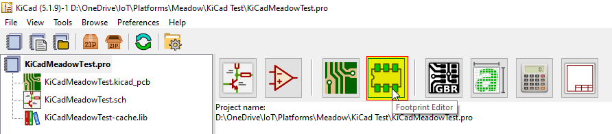

# KiCad Install instructions

## 1. Copy the files locally

Copy the `KiCad` folder wherever you like on your computer.

## 2. Install the Meadow F7 Micro board schema symbol

Use the `KiCad | Preferences | Manage Symbol Libraries...` command to manage the symbol library:

then select the global tab and click on the folder button:

navigate to your local `KiCad` folder, select the `KICAD_Meadow_EDA.lib` file and open it:

et voilà, the first step is completed:

You can now close the symbol libraries manager window.

## 3. Install the Meadow F7 Micro board footprint

You can use a similar approach to add the footprint to the footprint libraries manager, but I've found some issues that I've solved using the footprint editor, so here are the steps I suggest you to follow:

Open the footprint editor

wait for the footprints to load... then use the `File | Add Library` command:

select the `KICAD_Meadow_EDA.pretty` folder (yes, the folder represent a footprint library on KiCad):

and confirm the `Global` choice:

Now the library is installed on KiCad with the Meadow F7 Micro footprint (double click on it to see it on the editor pane):

Don't close the window as the next step start from here.

## 4. Install the Meadow F7 Micro board footprint 3D visual

If not already open, then open the the footprint editor

double click on the `KICAD_Meadow_EDA` footprint from the `MeadowF7Micro_w_outline` library and then click on the `Footprint properties` icon:

In the footprint properties window, first select the `3D Settings` tab. Please note that the preview shows only the PCB board with the footprint added on step 3, without any 3D representation of the Meadow F7 Micro board. Now click on the folder icon to add the 3D model:

Navigate to your local `KiCad` folder, select the `MeadowF7.wrl` file and wait until the model is shown in the right panel, then confirm with OK:

Now the 3D model is added to the footprint editor with the correct size and orientation and z-position (the model is placed on the PCB board):

now close the `Footprint Properties` window with the "Ok" button, and the `Footprint Editor`, obviously saving the changes.

## Conclusion

Now that you've installed the schema and footprint and added the 3D model to the footprint, you can use the Meadow F7 Micro board on your KiCad projects.

Have fun!
