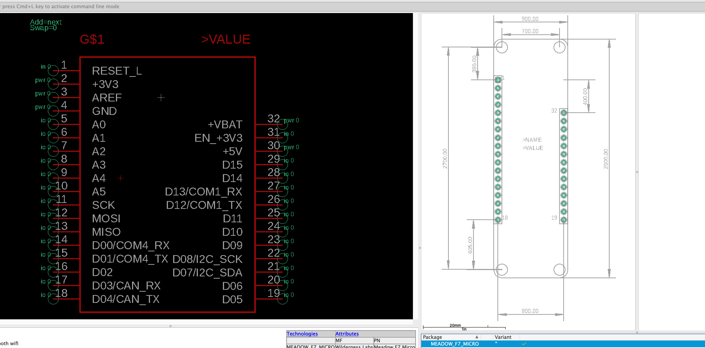
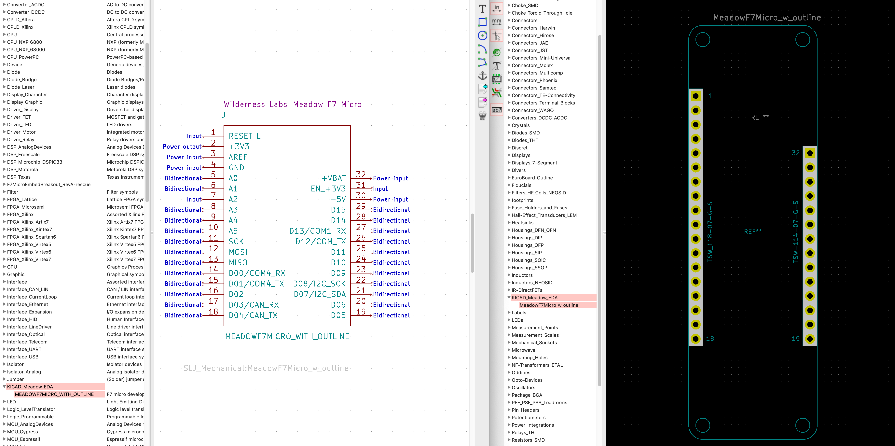
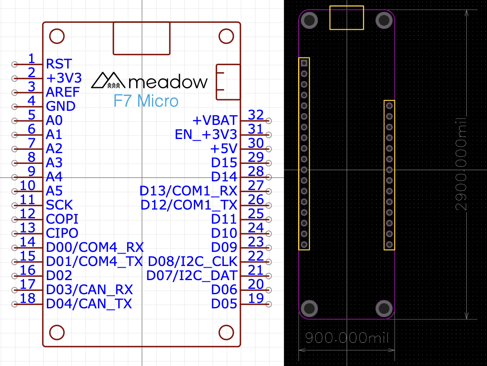
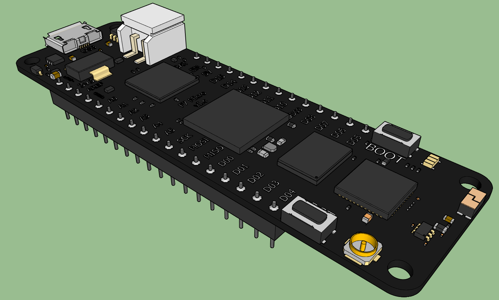
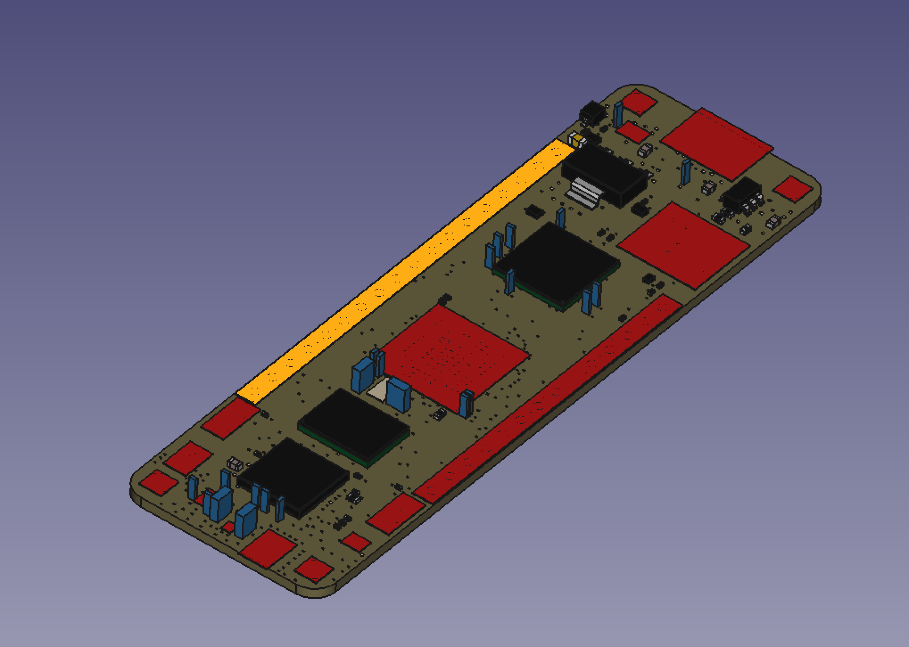

# Meadow EDA Parts

Contains the schematic symbols and PCB footprints for Meadow boards and modules for use in your designs.

## Install info

- [Eagle Install instructions](Eagle_Install.md)
- [KiCad Install instructions](KiCad_Install.md)

# Content

## Eagle Libraries

- `EAGLE_Meadow_EDA.lbr` has both schematic symbol and layout footprint

## KiCad Libraries

 - Schematic symbol located in `KICAD_Meadow_EDA.lib` file
 - Layout footpring located in `KICAD_Meadow_EDA.pretty` folder
 - 3D model located in `MeadowF7.wrl` file

## EasyEDA Libraries

EasyEDA symbols and footprints can be found by searching for "Meadow" in the EasyEDA _Library_.

## 3D Models

There are 3D models of our boards located in the 3D model folder:

- `MeadowF7.skp` is the 3D model of the board made in SketchUp by the contribution of Nicolò Carandini to produce the WRL format used for KiCad.

- `MeadowF7Micro_REVD.step` is the 3D model of the board saved in STEP format. It's not complete but it is a good starting point for creating more refined models.

