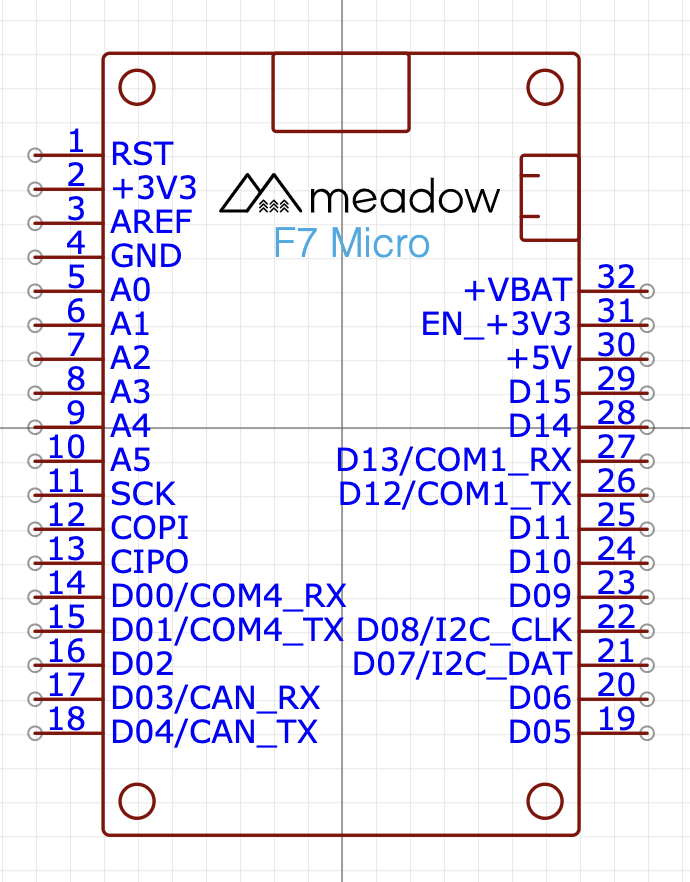
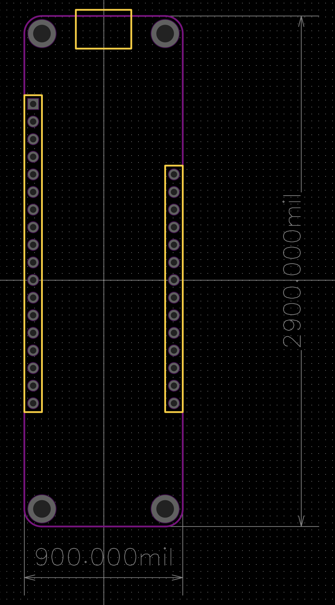

# Meadow EDA Parts

Contains the schematic symbols and PCB footprints for Meadow boards and modules for use in your designs.

# Libraries

## Eagle

- EAGLE_Meadow_EDA.lbr has both schematic symbol and layout footprint

## KiCad

 - Schematic symbol located in KICAD_Meadow_EDA.lib
 - Layout footpring located in KICAD_Meadow_EDA.pretty folder

## EasyEDA

EasyEDA symbols and footprints can be found by searching for "Meadow" in the EasyEDA _Library_.

# 3D Models
There are 3D models of our boards located in the 3D model folder. They are not complete but it is a good starting point. 

